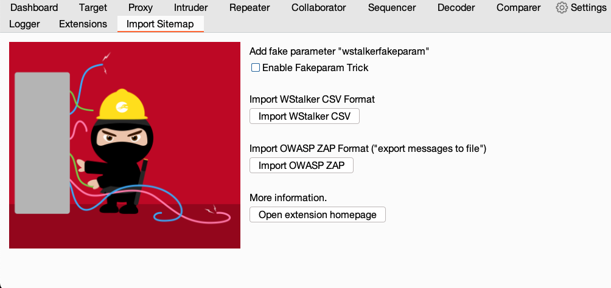
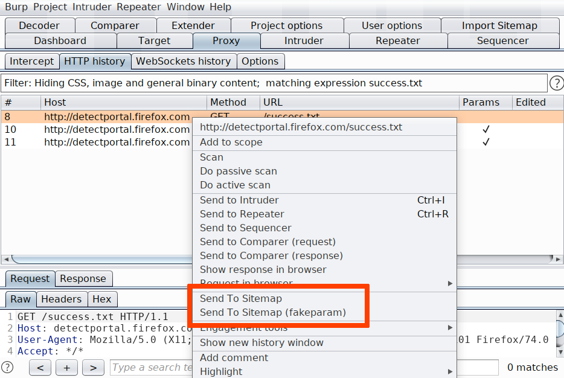

# Import To Sitemap Extension

Burp Extension to import [wstalker](https://github.com/nccgroup/wstalker) CSV file or [ZAP](ZAP.md) export file into Burp Sitemap.

Once the extension has been loaded into Burp, an additional tab called "Import Sitemap" is added. This new tab has a number of buttons to select and load the CSV file.

In addition, there is a checkbox called "Enable Fakeparam Trick", which is enabled by default. When enabled, a new artificial parameter "wstalkerfakeparam" is added to each request. The reason to do this is because sitemap does not add several requests with the same URL, so adding a fake parameter with random value will guarantee that every request/response is sucessfully imported.

When selecting the CSV file, all the requests and responses are loaded into the SiteMap. From there we can inspect and export them into Repeater, Intruder, etc.

The extension also includes two contextual menus that allow to import requests/responses from any other tool. The "no fakeparam" one will import as we had disabled the checkbox described above.

